<div align="center">

# 🛡️ Spotify God Mode V7
### (Project Titan)

[](https://github.com/yourusername/spotify-godmode)
[](LICENSE)
[](https://spicetify.app/)

**Lo script definitivo per un'esperienza musicale senza interruzioni e visivamente perfetta.**

*Questa suite "All-in-One" combina un potente motore interno con uno scudo visivo avanzato per garantire la massima pulizia dell'interfaccia e prestazioni elevate. Nessun compromesso.*

---

</div>

## ✨ Caratteristiche Principali

<table>
<tr>
<td>

### 🚀 Hybrid Engine V7
Motore interno ottimizzato che intercetta le richieste alla radice per prevenire interruzioni.

</td>
<td>

### 👁️ Visual Shield & UI Cleaner
Rimuove elementi grafici indesiderati, banner giganti (HPTO), e riquadri "Sponsorizzato" lasciando le playlist pulite.

</td>
</tr>
<tr>
<td>

### 🔒 God Mode Badge
Indicatore di stato integrato che conferma la protezione attiva in tempo reale.

</td>
<td>

### 🎨 Theme Compatible
Funziona perfettamente sopra qualsiasi tema personalizzato Spicetify grazie al posizionamento intelligente.

</td>
</tr>
<tr>
<td colspan="2" align="center">

### 🛠️ HPTO Killer
Modulo specifico per eliminare le sezioni "Takeover" nella Home.

</td>
</tr>
</table>

---

## 📦 Installazione Rapida

> **Prerequisito:** Assicurati di avere [Spicetify](https://spicetify.app/) installato sul tuo sistema.

### 🎯 Metodo 1: Installazione Automatica (Consigliato)

Apri il terminale (PowerShell o Bash) ed esegui questi comandi per scaricare e attivare lo script direttamente:

```bash
# 1. Entra nella cartella delle estensioni
cd "$(spicetify path)/Extensions"

# 2. Scarica lo script (Sostituisci URL_RAW con il link "Raw" del file noAdsV7.js dalla tua repo)
curl -O https://raw.githubusercontent.com/TUO_NOME_UTENTE/spicetify-noads-godmode/main/noAdsV7.js

# 3. Attiva solo questo script (rimuovendo vecchi conflitti)
spicetify config extensions noAdsV7.js

# 4. Applica le modifiche
spicetify apply
```

---

### 🔧 Metodo 2: Installazione Manuale

1. **Scarica** il file `noAdsV7.js` da questa repository.

2. **Sposta** il file nella cartella delle estensioni di Spicetify:
   - **Windows:** `%appdata%\spicetify\Extensions\`
   - **Linux/Mac:** `~/.config/spicetify/Extensions/`

3. **Esegui** i comandi di attivazione:

```bash
spicetify config extensions noAdsV7.js
spicetify apply
```

---

## ⚙️ Aggiornamento

Se viene rilasciata una nuova versione, basta riscaricare il file e riapplicare:

```bash
spicetify apply
```

---

## 🎮 Come Funziona

```mermaid
graph LR
    A[Spotify Client] --> B[Spicetify]
    B --> C[God Mode V7]
    C --> D[Hybrid Engine]
    C --> E[Visual Shield]
    C --> F[UI Cleaner]
    D --> G[Clean Experience ✨]
    E --> G
    F --> G
```



---

## 🤝 Contribuire

Le pull request sono benvenute! Per modifiche importanti, apri prima una issue per discutere cosa vorresti cambiare.

---

## ⚠️ Disclaimer

> **Nota Importante:** Questo progetto è a scopo educativo e di personalizzazione dell'interfaccia utente.  
> L'autore non è affiliato con Spotify AB.

---

<div align="center">

### 🌟 Se questo progetto ti è utile, lascia una stella!

**Created with ❤️ for the community**

---

[](https://github.com/yourusername/spotify-godmode)
[](https://github.com/yourusername/spotify-godmode)

</div>
